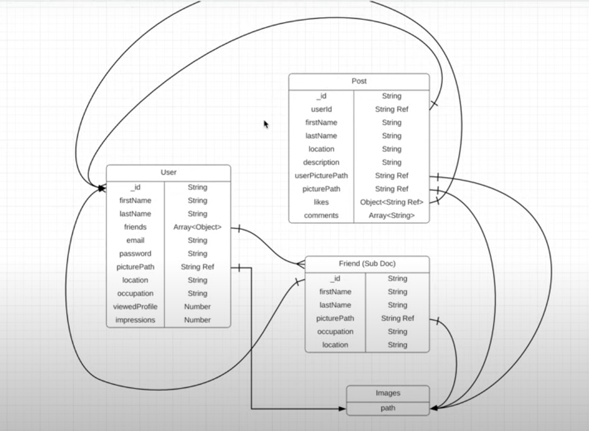

bcrypt (^5.1.1):
Used for hashing passwords securely. It helps in creating hashed versions of passwords for storage and comparison, improving security by not storing plain-text passwords.

body-parser (^1.20.3):
A middleware that parses incoming request bodies, making it easier to work with data sent in POST requests. It extracts the body portion of an incoming request and exposes it in req.body.

cors (^2.8.5):
Used to handle Cross-Origin Resource Sharing (CORS), which allows or restricts resources from being accessed by web pages from different origins. Essential for APIs accessed by external clients.

dotenv (^16.4.5):
Loads environment variables from a .env file into process.env, allowing you to securely manage sensitive data (like API keys) without hardcoding them in the codebase.

express (^4.21.1):
A fast and minimalist Node.js web application framework that provides a robust set of features for building web and mobile applications. It’s commonly used for handling routes, requests, and middleware.

gridfs-stream (^1.1.1):
Provides an interface for storing and retrieving large files (like images or videos) in MongoDB using the GridFS feature. This is especially useful for applications needing to store large files.

helmet (^8.0.0):
A security-focused middleware for Express applications that sets various HTTP headers to protect against common vulnerabilities, such as cross-site scripting (XSS), clickjacking, and others.

jsonwebtoken (^9.0.2):
A library for generating and verifying JSON Web Tokens (JWTs). Useful for implementing authentication and authorization, especially in RESTful APIs, by allowing users to carry identity data within the token.

mongoose (^8.7.3):
An Object Data Modeling (ODM) library for MongoDB and Node.js. It helps with schema definitions, querying, and other database-related tasks, simplifying interactions with MongoDB in Node.js applications.

morgan (^1.10.0):
A logging middleware for HTTP requests in Node.js, which provides a detailed log of requests and response times, helping with debugging and monitoring.

multer (^1.4.4):
A middleware for handling file uploads in Node.js, allowing applications to accept and store uploaded files from client requests.

multer-gridfs-storage (^5.0.2):
Extends Multer to store uploaded files directly into MongoDB’s GridFS, allowing for easy storage and retrieval of files in MongoDB alongside other data.

// Data Models 
